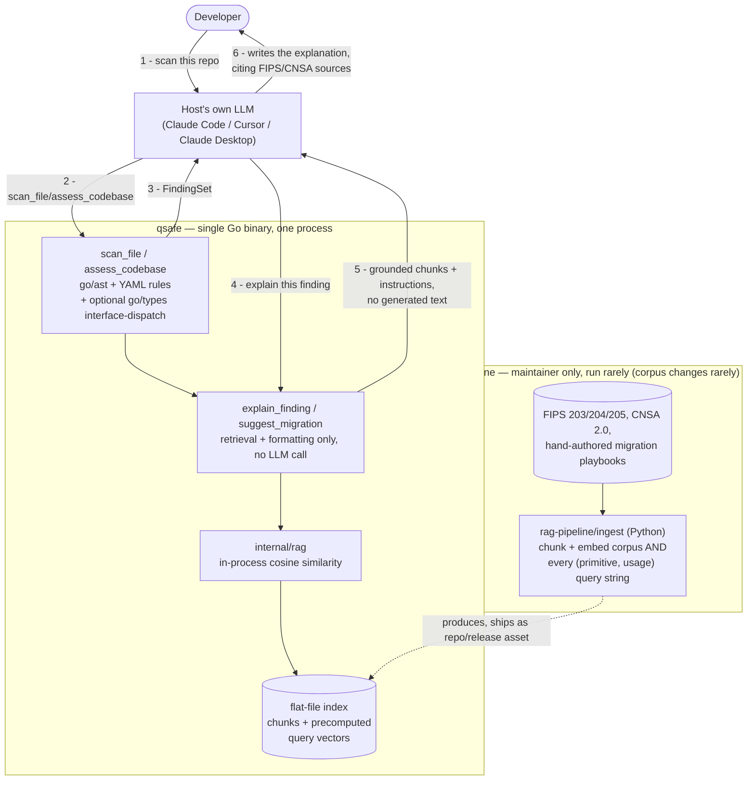

# qsafe: Architecture

> **PQC Migration Advisor**: A static analysis tool that scans Go codebases
> for classical cryptographic primitives, using Go's own `go/ast`/`go/types`
> tooling. It uses RAG over NIST PQC standards to generate concrete,
> spec-grounded migration guidance: what quantum-safe algorithm to replace
> each finding with, and how. Exposed as an MCP server for AI assistant
> integration.

---

## Data Flow (Runtime)

Everything inside the dashed `qsafe` boundary is **one Go binary, one
process**. The "Offline" box only ever runs on the maintainer's machine,
when the corpus changes; it is never part of what an end user runs.



---

## Design Principles

1. **MCP-first.** The primary interface is an MCP server consumed by Claude, Cursor, or any MCP-compatible host, launched directly by the host as a single binary.
2. **RAG is an implementation detail, embedded in the same binary.** MCP clients see only tool results. Retrieval runs in-process, with no separate service to run alongside it, and is swappable without changing the MCP interface.
3. **Shared core.** Static analysis logic lives in `internal/scanner/`, imported by the MCP server. Written once, reusable if other interfaces are added later.

---

## Repository Structure (Monorepo)

```
qsafe/
├── cmd/                # MCP server entrypoint + standalone CLI scanner
├── internal/
│   ├── scanner/         # Core static analysis engine, Go only
│   ├── findings/        # Shared finding data model
│   ├── rag/              # Embedded retrieval, in-process
│   └── explain/          # explain_finding/suggest_migration logic
├── mcp/                # MCP server setup + tool registration
├── rag-pipeline/       # Offline, maintainer-run corpus tooling (Python)
├── research/            # Historical design exploration, not wired into any build
├── testdata/            # Scanner test fixtures + real OSS repos for integration testing
├── .mcp.json.example
├── ARCHITECTURE.md
└── README.md
```

See "Component Overview" below for what each of `internal/scanner`,
`internal/rag`, `internal/explain`, and `rag-pipeline/` actually do.

---

## Component Overview

### 1. MCP Server (Go)

**What it is:** A long-running Streamable HTTP server at `/mcp` that exposes
four tools to any MCP-compatible LLM host.

**Stack:** Go, `modelcontextprotocol/go-sdk`

**Tools exposed:**

| Tool | Mechanism | Uses RAG? |
|---|---|---|
| `scan_file` | `go/ast` import-alias walk, YAML-rule-driven | No, pure static analysis |
| `explain_finding` | Retrieval only, no LLM call, see below | Yes, returns grounding chunks for the *calling* model to write from |
| `suggest_migration` | Retrieval only, no LLM call, see below | Yes, returns migration-playbook chunks for the *calling* model to write from |
| `assess_codebase` | Aggregation + scoring | Partially: RAG for compliance mapping |

**Tool details:**

`scan_file(path: string) → FindingSet`
- `go/parser` + `go/ast`: builds per-file import-alias map, walks call
  expressions, resolves `X.Fn(...)` against `rules/go/direct/*.yaml`'s
  per-package function allowlists. O(1) memory per file.
- `ScanDir` (used by `assess_codebase`) can optionally also run the
  interface-dispatch heuristic (`WithInterfaceDispatch`), which needs a
  buildable module (`go/types`/`go/packages`), off by default.
- Returns structured `FindingSet`: `[{ primitive, usage, file, line, severity, confidence, detail, context }]`
  , where `confidence` is `direct` or `heuristic`, see `internal/findings`.
- **`context`**: per-call-site info extracted by the same AST walk
  already visiting the call, including argument source text via `go/printer`
  (e.g. `rsa.GenerateKey(rand.Reader, 2048)` → `["rand.Reader", "2048"]`;
  not restricted to literals, since picking apart "which argument is the
  meaningful one" would need per-function-signature knowledge, the kind
  of hardcoded-in-Go primitive knowledge this project deliberately keeps
  out in favor of YAML rules) and the enclosing function/file (e.g.
  `useRSA`, not a `_test.go` file). Cheap: no new analysis tier, no
  call-graph traversal, just reading more off the same node
  (`internal/scanner/context_go.go`, shared by both the direct-call and
  interface-dispatch paths). Threaded through to `explain_finding`/
  `suggest_migration` (`FindingParams` → `contextClause` in
  `internal/explain`) as an extra grounding clause in `Instructions`.
  Explicitly does **not** include caller/reachability information (who
  calls this, what's downstream), since that's a different, much more
  expensive class of analysis; see "Future Enhancements" below.
- No RAG involved: pure deterministic analysis

`explain_finding(finding: Finding) → explain.Result` (`internal/explain`)
- Calls `internal/rag.Retrieve(primitive, usage, topK: 5)` directly, in-process
- Receives top-k chunks from FIPS/CNSA/annotation corpus
- **Does not call an LLM itself.** Returns `{ finding, chunks, instructions }`
  , the chunks as grounding, plus a plain-language instruction telling the
  *calling* model (the MCP host's own LLM, already in the conversation) to
  write the explanation from them, with citations. See `internal/explain`'s
  package doc for the full reasoning: it's the native MCP pattern (tools
  return context, the host model reasons over it), and it avoids
  duplicating generation capability the host already has.

`suggest_migration(finding: Finding) → explain.Result`
- Same shape and same no-LLM-call design as `explain_finding`. Only the
  retrieval query (usage-scoped to `<usage>_migration`, matching how the
  annotation playbooks are tagged) and the instructions text differ
  (asks for a concrete before/after code change + hybrid-mode caveat,
  not an explanation)

`assess_codebase(path: string) → CryptoInventoryReport`
- Calls `scan_file` across all files in path
- Aggregates findings into a CBOM (Cryptography Bill of Materials)
- Produces prioritized migration roadmap
- Maps findings to CNSA 2.0 compliance gaps

---

### 2. Retrieval (embedded in the Go binary)

**What it is:** An in-process Go package (`internal/rag`), called directly
by `internal/explain`. No HTTP boundary, no server, no port. The corpus is
small (a handful of PDFs plus hand-written playbooks, low thousands of
chunks at most), so in-memory search is a natural fit at this scale.

**The key enabler: the query side is bounded, not just the corpus.**
`explain_finding`/`suggest_migration` never take free-text queries. The
query is always exactly `(primitive, usage)`, drawn from the same small
enumerated set already in `rules/go/direct/shor.yaml`. That means query
embeddings, not just corpus embeddings, can be precomputed once at
ingestion time, so runtime needs **zero ML inference**, just array lookup
and arithmetic.

**Ingestion: offline, maintainer-run, Python (`rag-pipeline/ingest/`),
never shipped to end users:**
- `loader.py`: parse corpus PDFs
- `chunker.py`: section-aware chunking; metadata per chunk (`primitive_type`, `operation`, `source`)
- `embedder.py`: embeds every chunk *and* every possible `(primitive, usage)`
  query string (`sentence-transformers/all-MiniLM-L6-v2`, local, no API
  key), serializes both to a flat-file index
- Run only when the corpus changes: NIST standards change rarely
  (~annually at most). Output ships as a repo-committed file or a
  release asset (a few MB at this corpus size).

**Runtime (`internal/rag`):**
```
Retrieve(primitive, usage, topK)
    → look up the precomputed query vector for (primitive, usage)
    → cosine similarity against every stored chunk vector
      (linear scan, exact — not approximate; trivial at this scale)
    → optional BM25 blend (also precomputable arithmetic, no server)
    → sort, return top-k chunks
```

**The primitive→replacement mapping is a lookup table, not something RAG
retrieval figures out.** NIST/CNSA state *which classical algorithms are
Shor-broken*; they don't state *"RSA-signing → ML-DSA"* as a retrievable
sentence anywhere. That mapping is synthesized expert knowledge (the
actual "moat" this project provides, see the annotation playbooks
below), not something semantic search over the FIPS corpus could ever
reliably produce. So it's not a RAG-intelligence problem, it's a
config file: `rag-pipeline/corpus/migration_map.yaml` (planned, added
when Phase 2 starts), one entry per `(primitive, usage)` pair, e.g.:

```yaml
- primitive: RSA
  usage: signing
  replacement: ML-DSA
  standard: FIPS 204
- primitive: RSA
  usage: encryption
  replacement: ML-KEM
  standard: FIPS 203
- primitive: ED25519
  usage: signing
  replacement: ML-DSA
  alternative: SLH-DSA   # different math (hash-based) — defense-in-depth option
  standard: FIPS 204
```

**Keyed on `(primitive, usage)`, never on `primitive` alone.** This is
what actually resolves "how do we know if an algorithm is being used
for signing vs. key exchange without extra context": we already have
that context, because `rules/go/direct/*.yaml` assigns `usage`
**per function**, not per primitive (e.g. `rsa.SignPKCS1v15` →
`signing`, `rsa.EncryptPKCS1v15` → `encryption`, two separate findings
even though both are "RSA"). No new capability needed for this; the
data model already carries the disambiguating signal.

One correction worth recording since it clarifies the general
principle: RSA is genuinely dual-use (can sign *or* encrypt/key-wrap,
hence the ambiguity), but **not every primitive is**. Ed25519 (EdDSA)
and X25519 are different algorithms sharing Curve25519, not one
algorithm used two ways. Ed25519 is unambiguously signing-only; it
would never map to ML-KEM. The `(primitive, usage)` keying handles both
cases uniformly regardless: genuinely dual-use primitives just end up
with more than one row.

**Corpus:**

| Document | Coverage |
|---|---|
| FIPS 203 (ML-KEM) | Primary KEM replacement spec |
| FIPS 204 (ML-DSA) | Signature replacement |
| FIPS 205 (SLH-DSA) | Hash-based signature alternative |
| CNSA 2.0 Suite | NSA migration timeline requirements |
| RFC 9180 (HPKE) | Hybrid public key encryption |
| Hand-authored annotations | Curated migration playbooks, each tagged with a `<usage>_migration` key matching `suggest_migration`'s query |

**Update cadence:** Static index, rebuilt offline by the maintainer only
when the corpus changes.

---

### 3. Infrastructure

A single `go install`-able binary does scanning, retrieval, and MCP
serving in one process.

**Building the index (maintainer only, when the corpus changes):**
```bash
cd rag-pipeline
pip install -r requirements.txt
python -m ingest.loader && python -m ingest.chunker && python -m ingest.embedder
# → produces the flat-file index internal/rag reads at startup
```

**User setup (OSS):**
```bash
go install github.com/1MansiS/qsafe/cmd/mcp-server@latest
```

Then in `.mcp.json`:
```json
{
  "mcpServers": {
    "qsafe": {
      "command": "qsafe-mcp-server"
    }
  }
}
```

---

## Future Enhancements

Items deferred until after the OSS launch. Core static analysis logic in
`internal/scanner/` is already structured to support these without rework.

### CLI Interface
- `cmd/qsafe/main.go`: Cobra CLI with `scan`, `explain`, `assess` subcommands
- SARIF output for GitHub Code Scanning integration
- GitHub Actions workflow example: `qsafe assess` as a CI step
- Homebrew tap / `go install` distribution

### Call-graph context for explain_finding (considered, deferred, 2026-08-25)

Proposed alongside `Finding.Context` (per-call-site argument values +
enclosing function, which *did* get built, see `scan_file` above):
also passing a "mini call-graph" (who calls this, what's reachable from
where) to enrich `explain_finding`'s grounding, e.g. distinguishing
"this RSA key generation is reachable from production request handling"
vs. "only from a test fixture." Deferred rather than built: this is the
same class of interprocedural/reachability analysis already ruled
**permanently out of scope** in "Analysis depth" below, not a smaller
variant of it. Even a "mini" call-graph needs either whole-module
type-aware analysis (the same cost tier as the interface-dispatch
heuristic) or unreliable heuristics. Revisit only as a deliberate,
scoped decision on its own, not folded in casually alongside the cheap
per-call-site context that shipped instead.

### Analysis depth: a deliberate ceiling

qsafe does not do full interprocedural analysis (SSA and class
hierarchy/call-graph analysis across a module's whole transitive
dependency closure). That's a permanent scope boundary. The cost is real:
SSA and CHA over a module's full dependency closure runs roughly 2 to 5
times the transitive closure in memory, around 10 to 15 GB observed at
Vault and go-ethereum scale. The two tiers below cover the highest-value
part of this at a fraction of that cost.

**Two tiers, both implemented:**
1. **Direct calls** (default, always on). `go/parser` + `go/ast`, one
   file at a time, O(1) memory. Covers direct crypto calls
   (`rsa.GenerateKey(...)`) and one-hop function-variable indirection
   (`fn := rsa.GenerateKey; fn(...)`).
2. **Interface dispatch** (opt-in: `WithInterfaceDispatch` /
   `-interface-dispatch`). `go/types` and `go/packages`, needs a
   buildable module. A heuristic, not sound dataflow: attributes
   `crypto.Signer`/`crypto.Decrypter` call sites (including ones buried
   inside stdlib sinks like `x509.CreateCertificate`) to a candidate
   primitive when that primitive is also directly constructed elsewhere
   in the same module. Findings carry `Confidence: heuristic`, not the
   same certainty as a direct call. Validated against 5 real repos (see
   `rules/go/interface_dispatch.yaml`) before landing.

**Out of scope:** full call-chain attribution across arbitrary
interprocedural paths, cross-package interface resolution beyond the
same-module heuristic above, and anything requiring a whole-program SSA
build.

---

## Tech Stack Summary

| Layer | Technology | Rationale |
|---|---|---|
| MCP server | Go, `modelcontextprotocol/go-sdk` | Single binary, `go install`-able |
| Go static analysis | `go/parser` + `go/ast` (stdlib) | Zero deps, O(1) memory per file, handles all import alias forms |
| Interface-dispatch heuristic | `go/types` + `go/packages` | Real type info without full SSA/CHA cost; opt-in, needs a buildable module |
| Retrieval (runtime) | `internal/rag` (Go) | In-process cosine similarity over a precomputed flat-file index; see "Retrieval" above |
| Corpus ingestion (offline, maintainer-only) | Python, `sentence-transformers` | PDF parsing + embedding tooling is Python-native; never shipped to end users, run rarely (corpus changes rarely) |
| Embeddings | `sentence-transformers/all-MiniLM-L6-v2` | Local and free; computed once offline, both corpus chunks and the bounded query set |

---

## Key Architectural Decisions

**Why MCP-first?**
MCP is the differentiating component: it's what makes this an AI × security
project rather than another SAST linter. The agentic multi-tool chaining
(scan → explain → migrate in one conversation turn) is only possible via MCP.

**Why Go + Python at all, if there's no Python at runtime?**
Python is offline, maintainer-only corpus tooling now. PDF parsing and
embedding computation (`sentence-transformers`) are Python-native, and
fighting that ecosystem in Go for a step that runs maybe once a year
would waste effort with no user-facing benefit. Everything a user
actually runs (scanning, retrieval, MCP serving) is one Go binary.

**Why brute-force cosine similarity, not a vector index?**
The corpus is small (low thousands of chunks at most: FIPS 203/204/205,
CNSA 2.0, RFC 9180, hand-authored playbooks). At that scale, linear-scan
cosine similarity over an in-memory array is exact, not approximate, and
takes microseconds. Combined with the bounded query space (queries are
always `(primitive, usage)` pairs, never free text, see "Retrieval"
above), this keeps runtime retrieval to array lookup and arithmetic,
with no ML inference needed at request time.

**Why hybrid retrieval (dense + BM25)?**
Algorithm names like `ML-KEM-768`, `FIPS 203`, `RFC 9180` are exact tokens
that embedding similarity handles poorly. BM25 catches exact matches; dense
retrieval catches semantic similarity. Both are needed.

**Why section-aware chunking?**
Naive fixed-size chunking splits algorithm definitions mid-spec, producing
useless retrieved chunks. Section boundaries in NIST documents align with
algorithm units, so chunking there preserves the coherent unit of knowledge.

**Why hand-authored migration annotations?**
No public document has "RSA-2048 KEM → ML-KEM-768 via oqs-provider" in one
place. These playbooks encode domain expertise (SandboxAQ PQC + Veracode SAST
background) that no public corpus has. This is the primary moat of the project.
