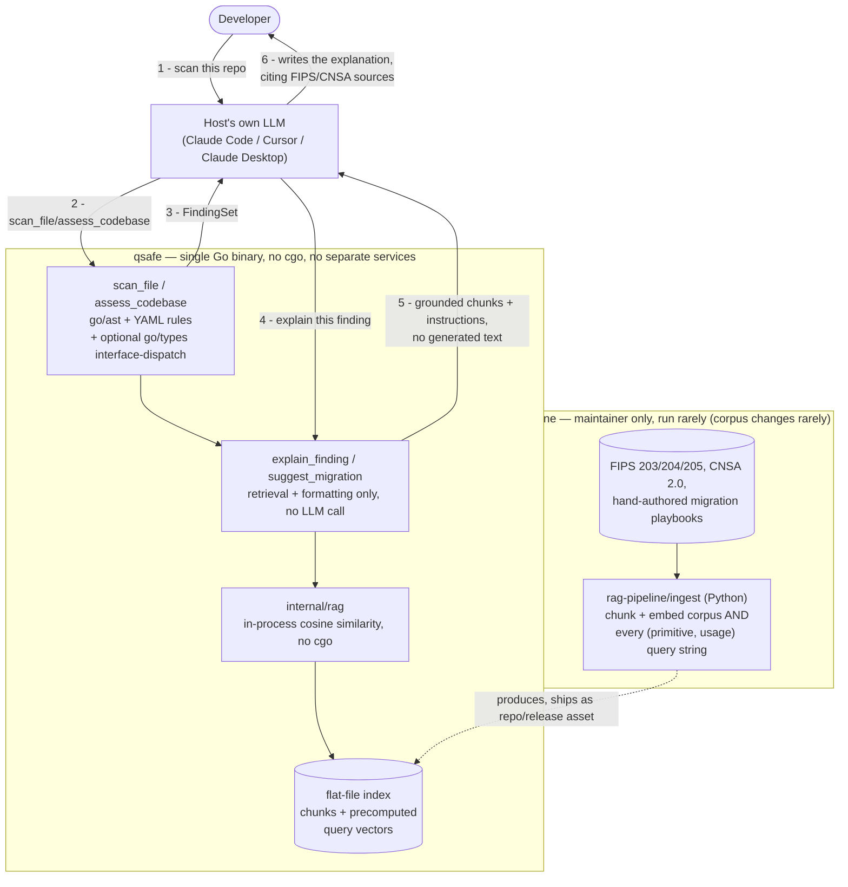

# qsafe — Architecture & Build Plan

> **PQC Migration Advisor**: A static analysis tool that scans codebases for
> classical cryptographic primitives and uses RAG over NIST PQC standards to
> generate concrete, spec-grounded migration guidance — exposed as an MCP server
> for AI assistant integration.

---

## Project Identity

| Field | Value |
|---|---|
| Name | `qsafe` |
| Module path | `github.com/1MansiS/qsafe` |
| MCP server image | `ghcr.io/1mansis/qsafe-mcp` |
| License | Apache 2.0 |

---

## Design Principles

1. **MCP-first.** The primary interface is an MCP server consumed by Claude, Cursor, or any MCP-compatible host.
2. **RAG is an implementation detail.** MCP clients see only tool results. The RAG pipeline is internal to the server — swappable without changing the MCP interface.
3. **Shared core.** Static analysis logic lives in `internal/scanner/` — imported by the MCP server. Written once, reusable if other interfaces are added later.
4. **Python is offline tooling, not a runtime dependency.** Reversed from the original design: there is no Python RAG service at runtime at all. Python (`rag-pipeline/ingest/`) only runs *offline*, maintainer-side, to build a flat-file retrieval index from the corpus — never shipped to or run by end users. See "Retrieval" below for why this was possible (the query space turned out to be bounded, not just the corpus).
5. **Single-binary everything, no cgo, no forced Docker.** Reversed from the original Docker-first plan: the entire tool — scanning, retrieval, MCP serving — is one self-contained Go binary, zero cgo, zero subprocess, `go install`-able, because the actual near-term distribution path is an MCP server launched directly by the host (Claude Desktop, Cursor, Claude Code), where a Docker Desktop dependency and container spin-up latency are real friction, not a convenience. A tree-sitter-go scanning engine was prototyped and evaluated (see `research/`) and found to tie on capability with `go/ast`; a Qdrant+FastAPI RAG service was designed and then dropped once the corpus size (low thousands of chunks at most) made a dedicated vector database disproportionate to the actual problem. Both times, the lighter option won once actually measured against the real requirement rather than assumed.

---

## Repository Structure (Monorepo)

```
qsafe/
├── cmd/
│   ├── mcp-server/         # MCP server entrypoint
│   └── scan/               # Standalone CLI scanner (also useful for local/CI testing)
│
├── internal/
│   ├── scanner/            # Core static analysis engine — Go only, see qsafe.md
│   │   ├── scanner.go      # ScanFile / ScanDir dispatch
│   │   ├── callgraph_go.go # go/parser + go/ast import-alias walk, direct calls;
│   │   │                   # also extracts per-call-site context (literal
│   │   │                   # argument values, enclosing function/file) — see
│   │   │                   # Finding.Context below
│   │   ├── interface_dispatch_go.go # go/types heuristic, opt-in (WithInterfaceDispatch)
│   │   ├── rules.go        # YAML rule loader (direct-call rules)
│   │   ├── rules/go/
│   │   │   ├── direct/*.yaml            # import+function allowlists per primitive
│   │   │   └── interface_dispatch.yaml  # crypto.Signer/Decrypter dispatch rules
│   │   └── codebase.go     # ScanDir: module walking + aggregation
│   ├── findings/           # Shared finding data model (Finding.Confidence: direct | heuristic)
│   ├── rag/                # Embedded retrieval — pure Go, no cgo, no server.
│   │   │                   # Loads the flat-file index built offline by
│   │   │                   # rag-pipeline/, does cosine similarity in-process.
│   │   │                   # No embedding model runs at runtime — see "Retrieval" below.
│   │   └── rag.go          # Retrieve(primitive, usage, topK) — called directly by internal/explain
│   └── explain/            # explain_finding/suggest_migration logic — retrieval
│       │                   # + formatting only, no LLM call; see package doc
│       ├── explain.go
│       └── migrate.go
│
├── research/                # Historical design exploration (tree-sitter-go
│                             # evaluation) — see research/README.md. Not wired
│                             # into any build; isolated as its own Go module.
│
├── mcp/
│   ├── server.go           # MCP server setup, tool registration
│   └── tools/
│       ├── scan_file.go
│       ├── explain_finding.go
│       ├── suggest_migration.go
│       └── assess_codebase.go
│
├── rag-pipeline/           # Offline, maintainer-run corpus tooling — Python,
│   │                       # never shipped to or run by end users. Run only
│   │                       # when the corpus changes (rarely).
│   ├── ingest/
│   │   ├── loader.py       # PDF/text corpus loader
│   │   ├── chunker.py      # Section-aware chunking, metadata tagging
│   │   └── embedder.py     # Embeds chunks *and* every (primitive, usage) query
│   │                       # string (sentence-transformers, local), writes the
│   │                       # flat-file index internal/rag reads at startup
│   └── corpus/             # Source documents (tracked in git)
│       ├── fips-203.pdf    # ML-KEM
│       ├── fips-204.pdf    # ML-DSA
│       ├── fips-205.pdf    # SLH-DSA
│       ├── cnsa-2.0.pdf    # NSA migration requirements
│       └── annotations/    # Mansi's hand-authored migration playbooks
│           ├── rsa-to-mlkem.md
│           ├── ecdh-to-mlkem.md
│           └── ecdsa-to-mldsa.md
│
├── testdata/
│   ├── gomod/              # Go fixture module for scanner tests
│   ├── indirect_gomod/     # one-hop indirection + interface-dispatch fixture
│   └── oss/                # Real OSS repos for integration testing
│
├── .mcp.json.example       # Drop-in config for Claude/Cursor users
├── ARCHITECTURE.md         # This file
└── README.md
```

---

## Component Overview

### 1. MCP Server (Go)

**What it is:** A long-running Streamable HTTP server at `/mcp` that exposes
four tools to any MCP-compatible LLM host.

**Stack:** Go, `modelcontextprotocol/go-sdk`

**Tools exposed:**

| Tool | Mechanism | Uses RAG? |
|---|---|---|
| `scan_file` | `go/ast` import-alias walk, YAML-rule-driven | No — pure static analysis |
| `explain_finding` | Retrieval only, no LLM call — see below | Yes — returns grounding chunks for the *calling* model to write from |
| `suggest_migration` | Retrieval only, no LLM call — see below | Yes — returns migration-playbook chunks for the *calling* model to write from |
| `assess_codebase` | Aggregation + scoring | Partially — RAG for compliance mapping |

**Tool details:**

`scan_file(path: string) → FindingSet`
- `go/parser` + `go/ast` — builds per-file import-alias map, walks call
  expressions, resolves `X.Fn(...)` against `rules/go/direct/*.yaml`'s
  per-package function allowlists. O(1) memory per file.
- `ScanDir` (used by `assess_codebase`) can optionally also run the
  interface-dispatch heuristic (`WithInterfaceDispatch`) — needs a
  buildable module (`go/types`/`go/packages`), off by default.
- Returns structured `FindingSet`: `[{ primitive, usage, file, line, severity, confidence, detail, context }]`
  — `confidence` is `direct` or `heuristic`, see `internal/findings`.
- **`context`**: per-call-site info extracted by the same AST walk
  already visiting the call — argument source text via `go/printer`
  (e.g. `rsa.GenerateKey(rand.Reader, 2048)` → `["rand.Reader", "2048"]`;
  not restricted to literals, since picking apart "which argument is the
  meaningful one" would need per-function-signature knowledge, the kind
  of hardcoded-in-Go primitive knowledge this project deliberately keeps
  out in favor of YAML rules) and the enclosing function/file (e.g.
  `useRSA`, not a `_test.go` file). Cheap — no new analysis tier, no
  call-graph traversal, just reading more off the same node
  (`internal/scanner/context_go.go`, shared by both the direct-call and
  interface-dispatch paths). Threaded through to `explain_finding`/
  `suggest_migration` (`FindingParams` → `contextClause` in
  `internal/explain`) as an extra grounding clause in `Instructions`.
  Explicitly
  does **not** include caller/reachability information (who calls this,
  what's downstream) — that's a different, much more expensive class of
  analysis, considered and deferred; see "Future Enhancements" below.
- No RAG involved — pure deterministic analysis

`explain_finding(finding: Finding) → explain.Result` (`internal/explain`)
- Calls RAG service: `POST /retrieve { primitive, usage, top_k: 5 }`
- Receives top-k chunks from FIPS/CNSA/annotation corpus
- **Does not call an LLM itself.** Returns `{ finding, chunks, instructions }`
  — the chunks as grounding, plus a plain-language instruction telling the
  *calling* model (the MCP host's own LLM, already in the conversation) to
  write the explanation from them, with citations. Deliberate design
  choice — see `internal/explain`'s package doc for the full reasoning:
  no API key needed (consistent with every other zero-setup choice in
  this project), it's the native MCP pattern (tools return context, the
  host model reasons over it), and it avoids duplicating generation
  capability the host already has.

`suggest_migration(finding: Finding) → explain.Result`
- Same shape and same no-LLM-call design as `explain_finding` — only the
  retrieval query (usage-scoped to `<usage>_migration`, matching how the
  annotation playbooks are tagged) and the instructions text differ
  (asks for a concrete before/after code change + hybrid-mode caveat,
  not an explanation)

`assess_codebase(path: string) → CryptoInventoryReport`
- Calls `scan_file` across all files in path
- Aggregates findings into a CBOM (Cryptography Bill of Materials)
- Produces prioritized migration roadmap
- Maps findings to CNSA 2.0 compliance gaps

---

### 2. Retrieval (embedded in the Go binary — no separate service)

**What it is:** An in-process Go package (`internal/rag`), called directly
by `internal/explain` — no HTTP boundary, no server, no port. Originally
scoped as a Python FastAPI service + Qdrant, dropped once the corpus size
(a handful of PDFs + hand-written playbooks, low thousands of chunks at
most) made a dedicated vector database disproportionate to the actual
retrieval problem. See `qsafe.md` for the full before/after reasoning.

**The key enabler: the query side is bounded, not just the corpus.**
`explain_finding`/`suggest_migration` never take free-text queries — the
query is always exactly `(primitive, usage)`, drawn from the same small
enumerated set already in `rules/go/direct/shor.yaml`. That means query
embeddings, not just corpus embeddings, can be precomputed once at
ingestion time — runtime needs **zero ML inference**, just array lookup
and arithmetic. (If a future need for genuinely open-ended queries
emerges, this assumption breaks and live embedding inference would be
needed again — a cgo ONNX binding, or a Python sidecar. Not a concern
today; the current design doesn't accept free-text input anywhere.)

**Ingestion — offline, maintainer-run, Python (`rag-pipeline/ingest/`),
never shipped to end users:**
- `loader.py`: parse corpus PDFs
- `chunker.py`: section-aware chunking; metadata per chunk (`primitive_type`, `operation`, `source`)
- `embedder.py`: embeds every chunk *and* every possible `(primitive, usage)`
  query string (`sentence-transformers/all-MiniLM-L6-v2`, local, no API
  key), serializes both to a flat-file index
- Run only when the corpus changes — NIST standards change rarely
  (~annually at most). Output ships as a repo-committed file or a
  release asset (a few MB at this corpus size).

**Runtime (`internal/rag`, pure Go, no cgo):**
```
Retrieve(primitive, usage, topK)
    → look up the precomputed query vector for (primitive, usage)
    → cosine similarity against every stored chunk vector
      (linear scan, exact — not approximate; trivial at this scale)
    → optional BM25 blend (also precomputable arithmetic, no server)
    → sort, return top-k chunks
```

**The primitive→replacement mapping is a lookup table, not something RAG
retrieval figures out.** NIST/CNSA state *which classical algorithms are
Shor-broken*; they don't state *"RSA-signing → ML-DSA"* as a retrievable
sentence anywhere — that mapping is synthesized expert knowledge (the
actual "moat" this project provides — see the annotation playbooks
below), not something semantic search over the FIPS corpus could ever
reliably produce. So it's not a RAG-intelligence problem, it's a
config file: `rag-pipeline/corpus/migration_map.yaml` (planned, added
when Phase 2 starts) — one entry per `(primitive, usage)` pair, e.g.:

```yaml
- primitive: RSA
  usage: signing
  replacement: ML-DSA
  standard: FIPS 204
- primitive: RSA
  usage: encryption
  replacement: ML-KEM
  standard: FIPS 203
- primitive: ED25519
  usage: signing
  replacement: ML-DSA
  alternative: SLH-DSA   # different math (hash-based) — defense-in-depth option
  standard: FIPS 204
```

**Keyed on `(primitive, usage)`, never on `primitive` alone** — this is
what actually resolves "how do we know if an algorithm is being used
for signing vs. key exchange without extra context": we already have
that context, because `rules/go/direct/*.yaml` assigns `usage`
**per function**, not per primitive (e.g. `rsa.SignPKCS1v15` →
`signing`, `rsa.EncryptPKCS1v15` → `encryption` — two separate findings
even though both are "RSA"). No new capability needed for this; the
data model already carries the disambiguating signal.

One correction worth recording since it clarifies the general
principle: RSA is genuinely dual-use (can sign *or* encrypt/key-wrap,
hence the ambiguity), but **not every primitive is** — Ed25519 (EdDSA)
and X25519 are different algorithms sharing Curve25519, not one
algorithm used two ways. Ed25519 is unambiguously signing-only; it
would never map to ML-KEM. The `(primitive, usage)` keying handles both
cases uniformly regardless — genuinely dual-use primitives just end up
with more than one row.

**Corpus:**

| Document | Coverage |
|---|---|
| FIPS 203 (ML-KEM) | Primary KEM replacement spec |
| FIPS 204 (ML-DSA) | Signature replacement |
| FIPS 205 (SLH-DSA) | Hash-based signature alternative |
| CNSA 2.0 Suite | NSA migration timeline requirements |
| RFC 9180 (HPKE) | Hybrid public key encryption |
| Hand-authored annotations | Curated migration playbooks, each tagged with a `<usage>_migration` key matching `suggest_migration`'s query |

**Update cadence:** Static index, rebuilt offline by the maintainer only
when the corpus changes.

---

### 3. Infrastructure

None required to run qsafe. No Docker, no Qdrant, no separate RAG
service, no API keys — a single `go install`-able binary does scanning,
retrieval, and MCP serving in one process.

**Building the index (maintainer only, when the corpus changes):**
```bash
cd rag-pipeline
pip install -r requirements.txt
python -m ingest.loader && python -m ingest.chunker && python -m ingest.embedder
# → produces the flat-file index internal/rag reads at startup
```

**User setup (OSS):**
```bash
go install github.com/1MansiS/qsafe/cmd/mcp-server@latest
```

Then in `.mcp.json`:
```json
{
  "mcpServers": {
    "qsafe": {
      "command": "qsafe-mcp-server"
    }
  }
}
```

---

## Data Flow (Runtime)

Everything inside the dashed `qsafe` boundary is **one Go binary, one
process** — no separate RAG service, no LLM call anywhere inside it. The
"Offline" box only ever runs on the maintainer's machine, when the
corpus changes; it is never part of what an end user runs.



---

## Phased Build Plan

### Phase 0 — Foundations (Week 1)
*Goal: repo skeleton, toolchain verified, nothing broken.* Historical —
describes the original Qdrant/FastAPI-based scaffold; superseded by the
embedded-retrieval design (see "Retrieval" above and `qsafe.md`), kept
for history rather than rewritten:

- [ ] Initialize monorepo: `go mod init github.com/1MansiS/qsafe`
- [ ] Scaffold directory structure (all dirs, empty `.go` and `.py` stubs)
- [ ] Confirm `modelcontextprotocol/go-sdk` compiles; write a hello-world MCP
      server that returns a hardcoded string
- [ ] Start local Qdrant via Docker: `docker run -p 6333:6333 -v qdrant_data:/qdrant/storage qdrant/qdrant`
- [ ] `rag-pipeline/api/main.py`: stub FastAPI with `/health` and `/retrieve`
      returning hardcoded chunks
- [ ] Wire Go MCP server → stub RAG service over HTTP; confirm round-trip
- [ ] Deliverable: MCP server registers one tool (`ping`), calls RAG stub,
      returns response. Visible in MCP Inspector.

---

### Phase 1 — Static Analysis Engine (Weeks 2–3)
*Goal: `scan_file` works end-to-end. No RAG yet.* ✅ **Complete, since
revised** — see `qsafe.md` for the full decision trail. Superseded
details below, kept for history rather than rewritten:

- [x] Go: `go/parser` + `go/ast` per-file import-alias scanner
      (`internal/scanner/callgraph_go.go`) — no type-checking, O(1) memory
- [x] ~~Python: embedded `pyast.py` visitor via `python3 -` subprocess~~ —
      built, then **removed** to keep the repo focused on Go; see
      `qsafe.md`'s "design for uniformity, build for Go only" note
- [x] ~~Detect: RSA, ECDH, ECDSA, ECC, AES-ECB, 3DES, DES, RC4, MD5, SHA-1~~ —
      scope later narrowed to **Shor-broken only** (RSA, ECDSA, ECDH,
      ECC); MD5/SHA-1/DES/3DES/RC4 are real crypto-hygiene issues but not
      quantum-migration relevant, removed from active rules
- [x] `internal/findings/`: `Finding`/`FindingSet` types, deduplication,
      plus `Confidence` (`direct`/`heuristic`) added later
- [x] `scan_file` and `assess_codebase` MCP tools registered and wired
- [x] Tested against `testdata/gomod/` (unit) and multiple real OSS repos
      (integration) — see `qsafe.md` for the current repo list and results
- [x] Deliverable: `scan_file` returns real findings. `ScanDir` scans full repos.
- [x] Rules moved from hardcoded Go maps to YAML (`rules/go/direct/*.yaml`)
- [x] Interface-dispatch heuristic added (`rules/go/interface_dispatch.yaml`,
      opt-in) — see "Analysis depth" below

---

### Phase 2 — Retrieval Index (Weeks 4–5)
*Goal: `internal/rag.Retrieve` returns real grounded chunks from the FIPS
corpus — no separate service, see "Retrieval" above for the design.*

- [ ] Collect corpus: download FIPS 203/204/205, CNSA 2.0, RFC 9180
- [ ] Write `ingest/chunker.py`: section-aware chunking with metadata tagging
- [ ] Write `rag-pipeline/corpus/migration_map.yaml`: the explicit,
      configurable `(primitive, usage) → replacement` lookup table — see
      "The primitive→replacement mapping is a lookup table, not
      something RAG retrieval figures out" above for the full design and
      why this is config, not inferred. One row per `(primitive, usage)`
      combination in `rules/go/direct/shor.yaml`, plus an `alternative`
      field where a hedge makes sense (e.g. SLH-DSA alongside ML-DSA).
- [ ] Write first-pass migration annotations for the active Shor-broken
      scope, each tagged with a `<usage>_migration` key matching what
      `suggest_migration` queries for — narrative/code-example detail
      elaborating on `migration_map.yaml`'s crisp mapping:
  - RSA signing → ML-DSA; RSA encryption → ML-KEM (two separate entries — see the RSA dual-use note above, not one "RSA → X" mapping)
  - ECDSA signing → ML-DSA
  - ECDH/ECC key_generation → ML-KEM
  - (3DES/MD5/SHA-1/etc. are out of scope — not Shor-broken, not in the
    active rule set, no annotation needed)
- [ ] Write `ingest/embedder.py`: embed chunks *and* every possible
      `(primitive, usage)`/`(primitive, usage+"_migration")` query string
      (`sentence-transformers/all-MiniLM-L6-v2`, local, no API key),
      serialize both to a flat-file index
- [ ] Implement `internal/rag/rag.go`: load the flat file at startup,
      cosine similarity + optional BM25 blend, pure Go, no cgo
- [ ] Wire `internal/explain` to call `internal/rag.Retrieve` directly
      (already calls `ragclient.Retrieve` today against the stub — swap
      the implementation, not the call site)
- [ ] Deliverable: `internal/rag.Retrieve` returns relevant FIPS chunks
      for every `(primitive, usage)` combination in the active rule set.

---

### Phase 3 — Explain & Migrate Tools (Week 6)
*Goal: `explain_finding` and `suggest_migration` work end-to-end with real RAG.*

- [x] `explain_finding`/`suggest_migration` MCP tools implemented in Go
      (`internal/explain`, `mcp/tools/{explain_finding,suggest_migration}.go`)
      — ahead of the RAG corpus itself, since the design (retrieval only,
      no LLM call — see `internal/explain`'s package doc) meant this was
      much smaller scope than originally planned and didn't need to wait
      on Phase 2's corpus work to build the plumbing. Currently tested
      against `ragclient`'s `/retrieve` stub over HTTP (`httptest`-based,
      `internal/explain/explain_test.go`) — once Phase 2 lands
      `internal/rag` and `internal/explain` switches to calling it
      in-process, these tests swap the HTTP stub for a small in-memory
      test index instead; the assertions (right query goes out, right
      Instructions come back) don't change.
- [ ] Cross-encoder reranking — reconsider whether it's worth it: with
      queries precomputed per `(primitive, usage)` (see "Retrieval"
      above) and a maintainer-curated corpus already tagged to match
      those queries, the retrieval precision reranking exists to fix in
      open-domain RAG may already be less of a problem here. If added,
      it's precomputable at ingestion time too, same as everything else.
- [ ] Deliverable: real demo once Phase 2's corpus lands — scan a Go file
      with RSA, `explain_finding` returns real FIPS/CNSA citations (not
      the `/retrieve` stub's placeholder text), calling model writes a
      grounded explanation and migration plan from them.

---

### Phase 4 — `assess_codebase` + CBOM (Week 7)
*Goal: repo-level analysis with prioritized output.*

- [ ] Implement `assess_codebase`: walk repo, call `scan_file` per file,
      aggregate `FindingSet`
- [ ] Implement severity × exploitability × migration-complexity scoring
- [ ] CNSA 2.0 compliance gap mapping
- [ ] Output: Crypto Bill of Materials (CBOM) — prioritized finding list +
      migration roadmap
- [ ] SARIF output format (foundation for future CI/CD integration)
- [ ] Deliverable: `assess_codebase` on a real OSS repo produces a meaningful
      CBOM report in Claude.

---

### Phase 5 — Hardening + OSS Launch (Week 8)
*Goal: project is demo-able, documented, and ready for public GitHub.*
No Docker/Qdrant deliverables here anymore — a prebuilt binary replaces
the image-publishing goal:

- [ ] `.mcp.json.example`: copy-paste config for Claude and Cursor users
- [ ] `README.md`: clear setup in under 5 minutes (`go install`, no
      Docker, no API keys), demo GIF/video
- [ ] MCP Inspector test pass: all four tools exercise correctly
- [ ] Test against several real OSS Go repos
- [ ] GitHub Actions CI: lint, test, cross-compile and publish release
      binaries per platform (macOS/Linux/Windows) on tag
- [ ] Publish to GitHub Releases; `go install github.com/1MansiS/qsafe/cmd/mcp-server@latest` as the primary install path
- [ ] Deliverable: public repo, working single-binary release, demo video.

---

## Future Enhancements

Items deferred until after the OSS launch. Core static analysis logic in
`internal/scanner/` is already structured to support these without rework.

### CLI Interface
- `cmd/qsafe/main.go`: Cobra CLI with `scan`, `explain`, `assess` subcommands
- SARIF output for GitHub Code Scanning integration
- GitHub Actions workflow example: `qsafe assess` as a CI step
- Homebrew tap / `go install` distribution

### Call-graph context for explain_finding (considered, deferred — 2026-08-25)

Proposed alongside `Finding.Context` (per-call-site argument values +
enclosing function, which *did* get built — see `scan_file` above):
also passing a "mini call-graph" (who calls this, what's reachable from
where) to enrich `explain_finding`'s grounding, e.g. distinguishing
"this RSA key generation is reachable from production request handling"
vs. "only from a test fixture." Deferred rather than built: this is the
same class of interprocedural/reachability analysis already ruled
**permanently out of scope** in "Analysis depth" below, not a smaller
variant of it — even a "mini" call-graph needs either whole-module
type-aware analysis (the same cost tier as the interface-dispatch
heuristic) or unreliable heuristics. Revisit only as a deliberate,
scoped decision on its own — not folded in casually alongside the cheap
per-call-site context that shipped instead.

### Analysis depth — a deliberate ceiling, not a roadmap gap

qsafe intentionally does **not** do full interprocedural analysis (SSA +
class hierarchy/call-graph analysis across a module's whole transitive
dependency closure). That's a permanent scope boundary, not a `--deep`
flag deferred to later — see `qsafe.md`'s design notes for the full
reasoning, in short: the cost (SSA + CHA over a module's full dependency
closure runs ~2–5× the transitive closure in memory — ~10–15 GB observed
at Vault/go-ethereum scale) isn't worth it against a lighter alternative
that was actually built and validated instead.

**What's actually implemented, two tiers:**
1. **Direct calls** (default, always on) — `go/parser` + `go/ast`, one
   file at a time, O(1) memory. `rsa.GenerateKey(...)`, one-hop
   function-variable indirection (`fn := rsa.GenerateKey; fn(...)`).
2. **Interface dispatch** (opt-in — `WithInterfaceDispatch`/`-deep`) —
   `go/types`/`go/packages`, needs a buildable module. A heuristic, not
   sound dataflow: attributes `crypto.Signer`/`crypto.Decrypter` call
   sites (including ones buried inside stdlib sinks like
   `x509.CreateCertificate`) to a candidate primitive only when that
   primitive is also directly constructed elsewhere in the same module.
   Findings carry `Confidence: heuristic`, not asserted with the same
   certainty as a direct call. Validated against 5 real repos before
   landing — see `rules/go/interface_dispatch.yaml` and `qsafe.md`.

**Permanently out of scope:** full call-chain attribution ("A → B → C →
rsa.GenerateKey" across arbitrary interprocedural paths), cross-package
interface resolution beyond the same-module heuristic above, and
anything requiring a whole-program SSA build. If a finding needs that
level of proof, it's a documented, accepted gap — see `qsafe.md`'s
tracked-gaps list — not something qsafe is working toward closing.

---

## Tech Stack Summary

| Layer | Technology | Rationale |
|---|---|---|
| MCP server | Go, `modelcontextprotocol/go-sdk` | Single binary, `go install`-able, no cgo |
| Go static analysis | `go/parser` + `go/ast` (stdlib) | Zero deps, O(1) memory per file, handles all import alias forms |
| Interface-dispatch heuristic | `go/types` + `go/packages` | Real type info without full SSA/CHA cost; opt-in, needs a buildable module |
| Retrieval (runtime) | `internal/rag`, pure Go, no cgo | In-process cosine similarity over a precomputed flat-file index — no server, no embedding model loaded at runtime; see "Retrieval" above |
| Corpus ingestion (offline, maintainer-only) | Python, `sentence-transformers` | PDF parsing + embedding tooling is Python-native; never shipped to end users, run rarely (corpus changes rarely) |
| Embeddings | `sentence-transformers/all-MiniLM-L6-v2` | Local, free, no API key; computed once offline, both corpus chunks and the bounded query set |

---

## Key Architectural Decisions

**Why MCP-first?**
MCP is the differentiating component — it's what makes this an AI × security
project rather than another SAST linter. The agentic multi-tool chaining
(scan → explain → migrate in one conversation turn) is only possible via MCP.

**Why Go + Python at all, if there's no Python at runtime?**
Python is offline, maintainer-only corpus tooling now — PDF parsing and
embedding computation (`sentence-transformers`) are Python-native, and
fighting that ecosystem in Go for a step that runs maybe once a year
would waste effort with no user-facing benefit. Everything a user
actually runs — scanning, retrieval, MCP serving — is one Go binary.

**Why not Qdrant (or any vector database)?**
Originally planned — dropped once the corpus size (low thousands of
chunks at most: FIPS 203/204/205, CNSA 2.0, RFC 9180, hand-authored
playbooks) made a dedicated vector database disproportionate to the
actual problem. A vector DB's value proposition is approximate-but-fast
search over millions of vectors via indexes like HNSW; at this scale,
brute-force cosine similarity over an in-memory array is *exact* (no
approximation) and takes microseconds — strictly better, not a
compromise. The further enabler: `explain_finding`/`suggest_migration`'s
queries are bounded to `(primitive, usage)` pairs, not free text, so
query embeddings can be precomputed offline too — runtime needs zero ML
inference, just array lookup and arithmetic. See "Retrieval" above.

**Why hybrid retrieval (dense + BM25)?**
Algorithm names like `ML-KEM-768`, `FIPS 203`, `RFC 9180` are exact tokens
that embedding similarity handles poorly. BM25 catches exact matches; dense
retrieval catches semantic similarity. Both are needed.

**Why section-aware chunking?**
Naive fixed-size chunking splits algorithm definitions mid-spec, producing
useless retrieved chunks. Section boundaries in NIST documents align with
algorithm units — chunking there preserves the coherent unit of knowledge.

**Why hand-authored migration annotations?**
No public document has "RSA-2048 KEM → ML-KEM-768 via oqs-provider" in one
place. These playbooks encode domain expertise (SandboxAQ PQC + Veracode SAST
background) that no public corpus has. This is the primary moat of the project.
