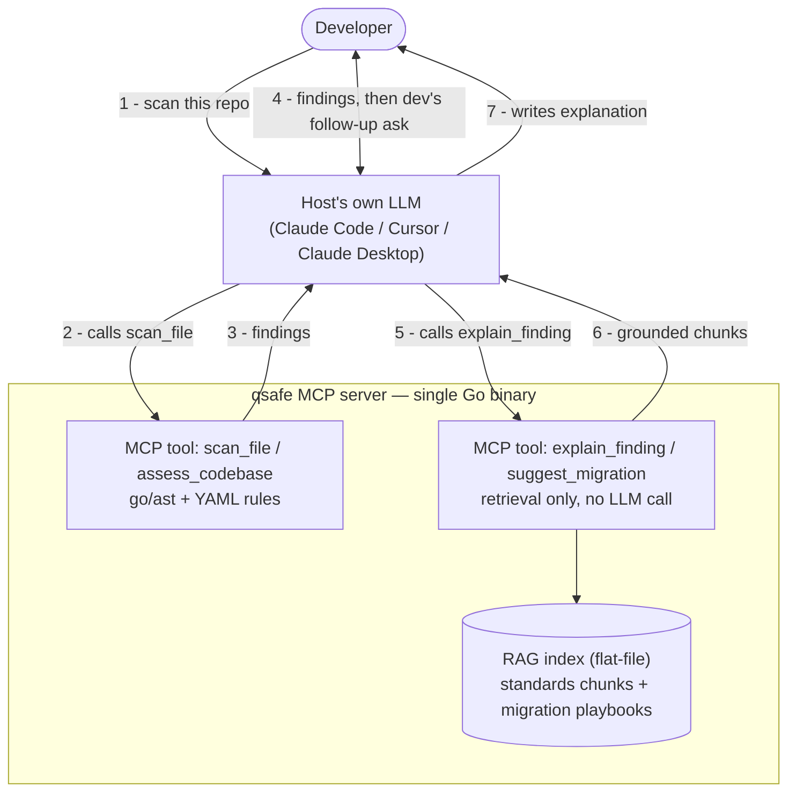

# qsafe: Architecture

> **PQC Migration Advisor**: A static analysis tool that scans Go codebases
> for classical cryptographic primitives, using Go's own `go/ast`/`go/types`
> tooling. It uses RAG over NIST PQC standards to generate concrete,
> spec-grounded migration guidance: what quantum-safe algorithm to replace
> each finding with, and how. Exposed as an MCP server for AI assistant
> integration.

---

## Data Flow (Runtime)

Everything in the `qsafe` box is **one Go binary, one process**. The two
MCP tools inside it are marked explicitly. The RAG index is built offline
by `rag-pipeline/` (Python, maintainer-run, only when the corpus
changes), then shipped with the binary; that build step isn't shown here
since it never runs on an end user's machine, see "Retrieval" below for
the offline pipeline itself.



---

## Example Session

*Placeholder. A real terminal recording or GIF goes here once the RAG
pipeline is wired end to end (Phase 2). Sketch of the intended flow:*

1. Developer, in Claude Code: "scan this repo for quantum-vulnerable crypto"
2. `scan_file` finds `rsa.EncryptPKCS1v15(...)` in `auth/session.go:42`, returns an `RSA`/`encryption` finding
3. Developer: "explain this one and tell me how to migrate it"
4. `explain_finding` + `suggest_migration` return grounded chunks: a FIPS 203 excerpt and the `rsa-to-mlkem` playbook
5. Claude writes the explanation and a concrete ML-KEM migration snippet, citing FIPS 203

---

## Design Principles

1. **MCP-first.** The primary interface is an MCP server consumed by Claude, Cursor, or any MCP-compatible host, launched directly by the host as a single binary.
2. **RAG is an implementation detail, embedded in the same binary.** MCP clients see only tool results. Retrieval runs in-process, with no separate service to run alongside it, and is swappable without changing the MCP interface.
3. **Shared core, `go/ast` is an implementation detail.** Static analysis logic lives in `internal/scanner/`; callers only ever see `ScanFile`/`ScanDir` returning `Finding`/`FindingSet`, never `go/ast` directly. Today that's `go/parser` + `go/ast`, chosen over tree-sitter-go for deployment simplicity (both were tied on capability, see `research/`), not because the interface demands it. Swapping the walker, or adding another language behind the same `Finding` shape, wouldn't touch a single caller.

---

## Repository Structure (Monorepo)

```
qsafe/
├── cmd/                # MCP server entrypoint + standalone CLI scanner
├── internal/
│   ├── scanner/         # Core static analysis engine, Go only
│   ├── findings/        # Shared finding data model
│   ├── rag/              # Embedded retrieval, in-process
│   └── explain/          # explain_finding/suggest_migration logic
├── mcp/                # MCP server setup + tool registration
├── rag-pipeline/       # Offline, maintainer-run corpus tooling (Python)
├── research/            # Historical design exploration, not wired into any build
├── testdata/            # Scanner test fixtures + real OSS repos for integration testing
├── .mcp.json.example
├── ARCHITECTURE.md
└── README.md
```

See "Component Overview" below for what each of `internal/scanner`,
`internal/rag`, `internal/explain`, and `rag-pipeline/` actually do.

---

## Component Overview

### 1. MCP Server (Go)

Long-running Streamable HTTP server at `/mcp`, `modelcontextprotocol/go-sdk`.
Four tools:

| Tool | Mechanism | Uses RAG? |
|---|---|---|
| `scan_file` | `go/ast` import-alias walk, YAML-rule-driven | No |
| `explain_finding` | Retrieval only, no LLM call | Yes, grounding chunks for the calling model to write from |
| `suggest_migration` | Retrieval only, no LLM call | Yes, migration-playbook chunks |
| `assess_codebase` | Aggregates `scan_file` across a repo | Partially, compliance mapping |

- `scan_file`: opt-in `go/types` interface-dispatch heuristic (`WithInterfaceDispatch`), off by default, needs a buildable module.
- Every finding carries `context`: enclosing function + argument source text, same AST walk, no call-graph, no extra analysis tier.
- `explain_finding`/`suggest_migration` never call an LLM. They return `{ finding, chunks, instructions }`; the *calling* model (already in the conversation) writes the explanation from the grounded chunks. See `internal/explain`'s package doc for the full reasoning.
- `assess_codebase`: aggregates findings into a CBOM (Cryptography Bill of Materials), maps to CNSA 2.0 compliance gaps.

---

### 2. Retrieval (embedded in the Go binary)

In-process Go package (`internal/rag`), called directly by `internal/explain`.
No server, no port. Corpus is small (low thousands of chunks at most), so
in-memory search is enough.

- **Bounded queries.** `explain_finding`/`suggest_migration` only ever query `(primitive, usage)`, a small fixed set already in `rules/go/direct/shor.yaml`. Query embeddings, not just corpus embeddings, get precomputed offline too; runtime needs zero ML inference.
- **Ingestion** (offline, maintainer-run, `rag-pipeline/ingest/`, never shipped): `loader.py` parses PDFs, `chunker.py` does section-aware chunking, `embedder.py` embeds chunks and every `(primitive, usage)` query string (`sentence-transformers/all-MiniLM-L6-v2`, local). Runs only when the corpus changes.
- **Runtime.** `Retrieve(primitive, usage, topK)`: look up the precomputed query vector, cosine similarity against every chunk vector (linear scan, exact at this scale), optional BM25 blend, return top-k.
- **Mapping is config, not RAG.** `(primitive, usage) → replacement` is a lookup table (`migration_map.yaml`), not something semantic search infers, since NIST doesn't state "RSA-signing → ML-DSA" anywhere as a retrievable sentence. See the worked example below for a full row.
- **Keyed on `(primitive, usage)`, not primitive alone.** `shor.yaml` already assigns `usage` per function (e.g. `rsa.SignPKCS1v15` is `signing`, `rsa.EncryptPKCS1v15` is `encryption`), so dual-use primitives like RSA just get two rows instead of one ambiguous one.

**Corpus:**

| Document | Coverage |
|---|---|
| FIPS 203 (ML-KEM) | Primary KEM replacement spec |
| FIPS 204 (ML-DSA) | Signature replacement |
| FIPS 205 (SLH-DSA) | Hash-based signature alternative |
| CNSA 2.0 Suite | NSA migration timeline requirements |
| RFC 9180 (HPKE) | Hybrid public key encryption |
| Hand-authored annotations | Curated migration playbooks, each tagged with a `<usage>_migration` key matching `suggest_migration`'s query |

---

### 3. Infrastructure

A single `go install`-able binary does scanning, retrieval, and MCP
serving in one process.

**Building the index (maintainer only, when the corpus changes):**
```bash
cd rag-pipeline
pip install -r requirements.txt
python -m ingest.loader && python -m ingest.chunker && python -m ingest.embedder
# → produces the flat-file index internal/rag reads at startup
```

**User setup (OSS):**
```bash
go install github.com/1MansiS/qsafe/cmd/mcp-server@latest
```

Then in `.mcp.json`:
```json
{
  "mcpServers": {
    "qsafe": {
      "command": "qsafe-mcp-server"
    }
  }
}
```

---

## Worked Example: One Thread Through the Pipeline

RSA encryption, end to end: the detection rule, the finding it produces,
the config that maps it to a replacement, and the two kinds of chunk
`explain_finding`/`suggest_migration` retrieve for it.

**1. Detection rule** (`internal/scanner/rules/go/direct/shor.yaml`):
```yaml
- primitive: RSA
  import: crypto/rsa
  functions:
    EncryptPKCS1v15: encryption
```

**2. The finding it produces** (`findings.Finding`, shape only):
```json
{
  "primitive": "RSA",
  "usage": "encryption",
  "file": "auth/session.go",
  "line": 42,
  "confidence": "direct"
}
```

**3. The replacement lookup** (`migration_map.yaml`, planned):
```yaml
- primitive: RSA
  usage: encryption
  replacement: ML-KEM
  standard: FIPS 203
```

**4. A standards chunk `explain_finding` retrieves** (real, from the
FIPS 203 chunker built in Phase 2's step 4, `internal/rag`'s `algorithm: ML-KEM`
join key resolves to this):
```json
{
  "id": "fips-203#8",
  "source": "fips-203",
  "section": "8 Parameter Sets",
  "algorithm": "ML-KEM",
  "doc_type": "standard",
  "text": "NIST recommends using ML-KEM-768 as the default parameter set, as it provides a large security margin at a reasonable performance cost..."
}
```

**5. A playbook chunk `suggest_migration` retrieves** (illustrative,
`rsa-to-mlkem.md` isn't written yet, this is the target shape):
```json
{
  "id": "rsa-to-mlkem#1",
  "source": "rsa-to-mlkem",
  "algorithm": "ML-KEM",
  "doc_type": "playbook",
  "primitive": "RSA",
  "usage": "encryption_migration",
  "text": "Before: rsa.EncryptPKCS1v15(...). After: ML-KEM key encapsulation via <Go PQC library, not yet pinned>. Hybrid mode caveat: ..."
}
```

Both chunks share `algorithm: ML-KEM`, that's the join `internal/rag`
uses; both get returned to the calling model, which writes the final
explanation citing FIPS 203 and following the playbook's concrete
before/after.

---

## Future Enhancements

Items deferred until after the OSS launch. Core static analysis logic in
`internal/scanner/` is already structured to support these without rework.

### CLI Interface
- `cmd/qsafe/main.go`: Cobra CLI with `scan`, `explain`, `assess` subcommands
- SARIF output for GitHub Code Scanning integration
- GitHub Actions workflow example: `qsafe assess` as a CI step
- Homebrew tap / `go install` distribution

### Call-graph context for explain_finding (considered, deferred, 2026-08-25)

Proposed alongside `Finding.Context` (per-call-site argument values +
enclosing function, which *did* get built, see `scan_file` above).

- Would pass a "mini call-graph" (who calls this, what's reachable from where) to `explain_finding`, e.g. distinguishing "reachable from production request handling" vs. "only from a test fixture."
- Same interprocedural/reachability class already ruled **permanently out of scope** below, not a smaller variant of it. Even "mini" needs whole-module type-aware analysis (same cost tier as interface-dispatch) or unreliable heuristics.
- Revisit only as its own deliberate, scoped decision, not folded in alongside the cheap per-call-site context that shipped instead.

### Analysis depth: a deliberate ceiling

- No full interprocedural analysis (SSA and class hierarchy/call-graph analysis across a module's whole transitive dependency closure). Permanent scope boundary.
- Real cost: SSA/CHA over a module's full dependency closure runs roughly 2 to 5 times the transitive closure in memory, 10 to 15 GB observed at Vault and go-ethereum scale.
- The two tiers below cover the highest-value part of this at a fraction of that cost.

**Two tiers, both implemented:**
1. **Direct calls** (default, always on). `go/parser` + `go/ast`, one
   file at a time, O(1) memory. Covers direct crypto calls
   (`rsa.GenerateKey(...)`) and one-hop function-variable indirection
   (`fn := rsa.GenerateKey; fn(...)`).
2. **Interface dispatch** (opt-in: `WithInterfaceDispatch` /
   `-interface-dispatch`). `go/types` and `go/packages`, needs a
   buildable module. A heuristic, not sound dataflow: attributes
   `crypto.Signer`/`crypto.Decrypter` call sites (including ones buried
   inside stdlib sinks like `x509.CreateCertificate`) to a candidate
   primitive when that primitive is also directly constructed elsewhere
   in the same module. Findings carry `Confidence: heuristic`, not the
   same certainty as a direct call. Validated against 5 real repos (see
   `rules/go/interface_dispatch.yaml`) before landing.

**Out of scope:** full call-chain attribution across arbitrary
interprocedural paths, cross-package interface resolution beyond the
same-module heuristic above, and anything requiring a whole-program SSA
build.

---

## Tech Stack Summary

| Layer | Technology | Rationale |
|---|---|---|
| MCP server | Go, `modelcontextprotocol/go-sdk` | Single binary, `go install`-able |
| Go static analysis | `go/parser` + `go/ast` (stdlib) | Zero deps, O(1) memory per file, handles all import alias forms |
| Interface-dispatch heuristic | `go/types` + `go/packages` | Real type info without full SSA/CHA cost; opt-in, needs a buildable module |
| Retrieval (runtime) | `internal/rag` (Go) | In-process cosine similarity over a precomputed flat-file index; see "Retrieval" above |
| Corpus ingestion (offline, maintainer-only) | Python, `sentence-transformers` | PDF parsing + embedding tooling is Python-native; never shipped to end users, run rarely (corpus changes rarely) |
| Embeddings | `sentence-transformers/all-MiniLM-L6-v2` | Local and free; computed once offline, both corpus chunks and the bounded query set |

---

## Key Architectural Decisions

**Why MCP-first?**
- MCP is the differentiator: makes this an AI × security project, not another SAST linter.
- Multi-tool chaining (scan → explain → migrate in one conversation turn) only works via MCP.

**Why Go + Python at all, if there's no Python at runtime?**
- Python is offline, maintainer-only corpus tooling: PDF parsing and embedding (`sentence-transformers`) are Python-native.
- Fighting that ecosystem in Go, for a step that runs maybe once a year, wastes effort for no user-facing benefit.
- Everything a user actually runs (scanning, retrieval, MCP serving) is one Go binary.

**Why brute-force cosine similarity, not a vector index?**
- Corpus is small (low thousands of chunks at most: FIPS 203/204/205, CNSA 2.0, RFC 9180, hand-authored playbooks).
- At that scale, linear-scan cosine similarity over an in-memory array is exact, not approximate, and takes microseconds.
- Bounded query space (`(primitive, usage)` pairs, never free text) keeps runtime to array lookup and arithmetic, no ML inference at request time.

**Why hybrid retrieval (dense + BM25)?**
- Exact tokens (`ML-KEM-768`, `FIPS 203`, `RFC 9180`) embedding similarity handles poorly.
- BM25 catches exact matches; dense retrieval catches semantic similarity. Both needed.

**Why section-aware chunking?**
- Naive fixed-size chunking splits algorithm definitions mid-spec, useless retrieved chunks.
- NIST section boundaries already align with algorithm units; chunking there preserves the coherent unit of knowledge.

**Why hand-authored migration annotations?**
- No public document states "RSA-2048 KEM → ML-KEM-768 via oqs-provider" anywhere.
- Playbooks encode domain expertise (SandboxAQ PQC + Veracode SAST background) that no public corpus has. Primary moat of the project.
